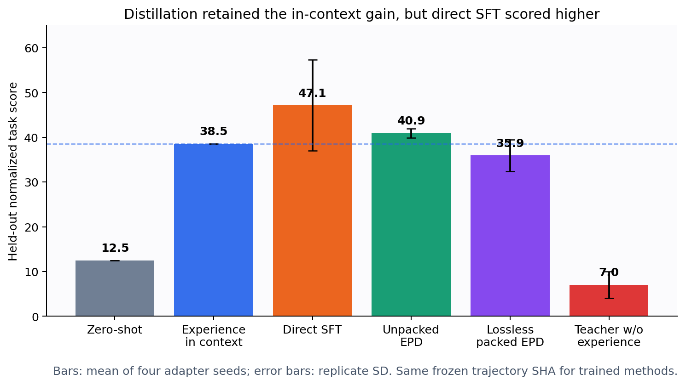
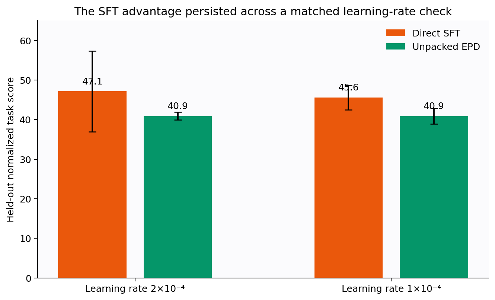
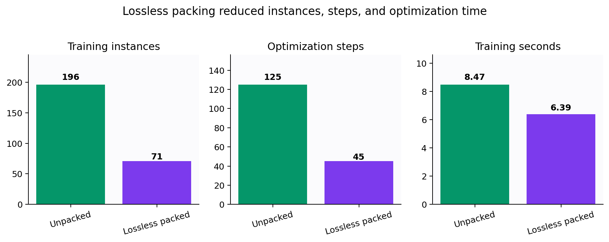
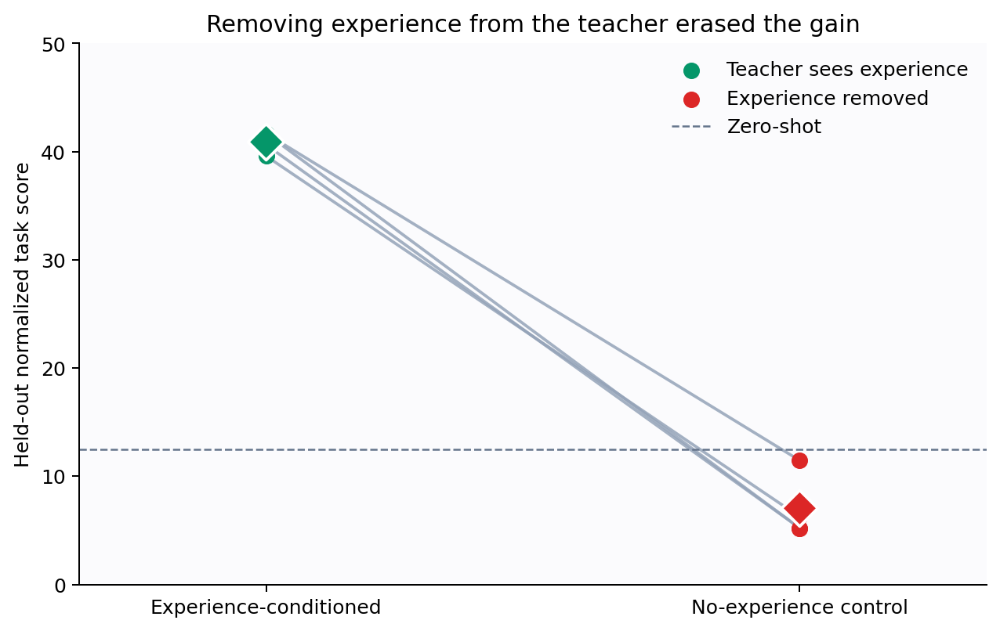

# Can an agent internalize useful experience without acting again?

Language agents often improve when their previous attempts remain visible, but that advantage disappears when the history is removed. The paper proposes “Experience Distillation”: let a teacher consult the old interaction record, ask it for improved next actions at already-recorded states, and train a student that never sees the record. This reproduction asks whether that transfer beats simply training on the recorded actions themselves.

## Verdict

**Partially reproduced on the substituted public setup.** Experience-conditioned one-step targets transferred a large gain and the no-experience control erased it, supporting the proposed mechanism. However, direct supervised fine-tuning (SFT) scored **47.14** versus **40.89** for unpacked distillation, reversing the paper’s central ordering; lossless packing reduced work and was statistically compatible with unpacked performance at four seeds, but its mean was lower.

Scope: TextWorldExpress 1.1.0 rather than TaleSuite, three games rather than six, Qwen2.5-0.5B-Instruct rather than an undisclosed in-house model, and LoRA adapters. All results ran on Kubernetes with NVIDIA RTX PRO 6000 Blackwell GPUs, peaking at 16 concurrent GPUs. The compute campaign took **0.341342 wall-hours** from the fresh-attempt cutoff to the final scientific result.

How to read this figure: zero-shot is the model without history; “experience in context” is the temporary upper reference; trained students are evaluated without that history. Distillation retained the reference gain, but direct SFT was higher and more variable. Each trained bar is four adapter seeds; error bars are replicate standard deviations.

## What was tested

The paper reports, on six TaleSuite games, normalized scores of 18.5 zero-shot, 45.6 with experience in context, 17.8 after direct SFT, and 43.8 after Experience Distillation. Those correspond to −2.6% and 93.4% of the available in-context gain for SFT and distillation.

Here, fixed TextWorldExpress tasks covered Coin Collector, Map Reader, and TextWorld Commonsense. Six seeds supplied one exploratory and one successful attempt per task; 196 recorded decisions were frozen at SHA-256 `0907bc…3254`. Evaluation used eight disjoint seeds from the same benchmark fold. Every target was generated from the frozen text only—**zero target-generation environment interactions**.

The important code path is compact:

1. `collect_frozen` records observations, valid actions, actions, rewards, and outcomes.
2. `experience_guide` compresses successful experience into game-level rules and action patterns.
3. `make_teacher_examples` asks the unchanged base model for one next action at each recorded state; only the teacher sees the guide.
4. `train_adapter` optimizes action tokens while masking prompt and observation tokens.
5. `evaluate` runs the student without experience on held-out seeds.

Four independent seeds ran inside each 4-GPU Kubernetes job, one seed per GPU.

## Claim 1: distillation versus direct training

Unpacked distillation reached **40.89 ± 0.99** and retained **109%** of the in-context gain. Direct SFT reached **47.14 ± 10.19** and retained **133%**. A matched lower-learning-rate check preserved the ordering: 45.57 for SFT versus 40.89 for distillation.

Keeping more successful action mappings in the teacher prompt improved distillation to 43.75, but still did not exceed direct SFT’s mean. Thus this run shows that one-step targets can internalize experience, but **does not show that they outperform direct SFT**. The likely substitution-sensitive factors are unusually informative gold-path actions in the public corpus, the 0.5B teacher, and the small task set.

## Claim 2: packing and teacher access

Naïve packing truncated 223 target tokens, so we added a lossless splitter before comparing efficiency. Lossless packing kept all 790 supervised tokens while reducing training instances **196→71**, optimization steps **125→45**, and training time **8.47→6.39 seconds**.

Its score was 35.94 ± 3.55 versus 40.89 ± 0.99 unpacked. The paired mean gap was 4.95 points; with only four seeds, its 95% interval was −1.31 to 11.20 points and included zero. That is compatible with “matches within uncertainty,” although the mean penalty and modest 1.33× speedup are less favorable than the paper’s 43.1 versus 43.8 and >10× total-time reduction.

Removing experience from the teacher was much clearer: score fell from 40.89 to **7.03**, below the 12.50 zero-shot baseline. Teacher agreement with recorded actions also fell from 30.6% to 21.4%.

## Claim-level assessment

| Claim | Paper | Observed | Assessment |
|---|---|---|---|
| EPD retains more gain than direct SFT | 93.4% vs −2.6% | 109% vs 133% | Divergent under this setup |
| Packing preserves performance with less work | 43.8 vs 43.1; >10× time | 35.94 vs 40.89; 1.33× train time | Partially aligned / uncertain |
| Teacher must see experience | Gain depends on privileged context | 40.89 → 7.03 when removed | Aligned |

Formal job durations were 1m18s–1m23s per matched method on 4 GPUs; failures before user code are excluded from evidence but preserved in the experiment tree. A full reproduction still needs the original TaleSuite assets, in-house checkpoint and prompts, longer training, and the paper’s 16+ evaluation runs. See the [self-contained notebook](../../notebooks/experience_distillation_reproduction.py) for every replicate and calculation.
