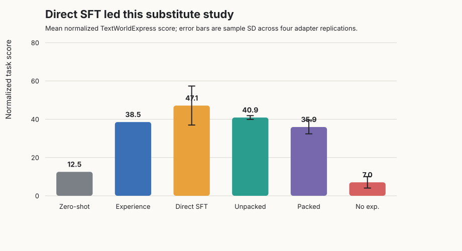
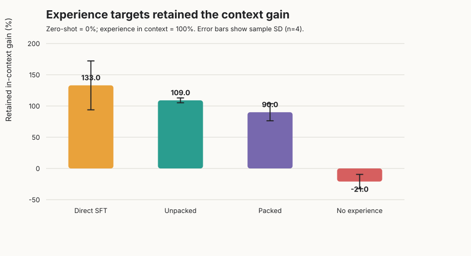
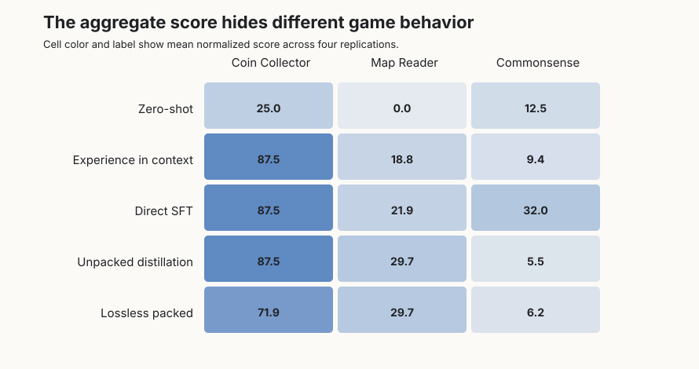
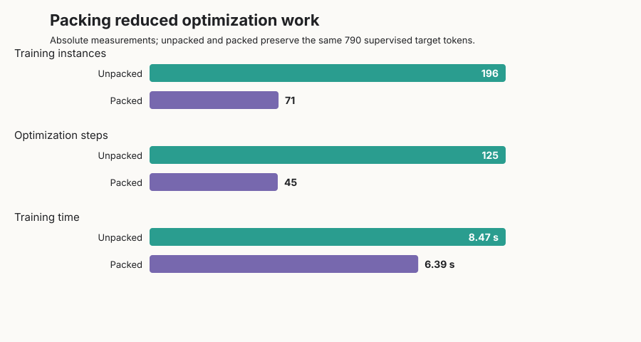
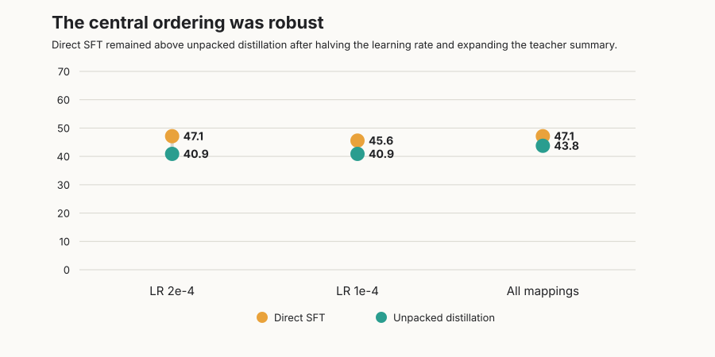

# Experience Distillation on a Public Text-Adventure Benchmark

Language agents can improve when earlier attempts remain in their prompt, but that improvement disappears when the history is removed. The paper proposes teaching a fresh-context student to imitate one-step decisions made by a teacher that can see the experience, thereby moving the useful lesson into model weights without interacting with the environment again. This reproduction asks whether that mechanism beats simply training on the recorded attempts themselves.

**Verdict: partially reproduced.** Experience-conditioned one-step targets retained the context benefit and the no-experience control erased it, but the paper’s central advantage over direct supervised fine-tuning did not appear in this smaller public substitute. Branch packing was materially cheaper and statistically unresolved from unpacked distillation with only four paired replications, although its point estimate was lower.

**Scope.** We replaced unavailable TaleSuite games and the in-house model with three Apache-2.0 TextWorldExpress tasks and Qwen2.5-0.5B-Instruct LoRA adapters. This tests the mechanism, not the paper’s six-game absolute result or its software-engineering campaign.

Read the bars as average normalized task score: zero-shot is the model without history, “Experience” keeps compressed earlier attempts in context, and the remaining students evaluate without that context. The paper reported 43.8 for distillation versus 17.8 for direct SFT; here direct SFT reached **47.14 ± 10.19**, while unpacked distillation reached **40.89 ± 1.00** (mean ± sample SD, four adapter replications).

## From interaction history to one-step targets

We generated fixed Coin Collector, Map Reader, and TextWorld Commonsense instances. For each of six training seeds per game, one exploratory attempt and one successful gold-path attempt were recorded, yielding 18 experience records and 196 environment interactions. The exact corpus was frozen at SHA-256 `0907bc8e3ee60412128915f260b56772a2a59d2e22922e332ec77a8519203254`.

The experience preprocessor extracted short behavioral rules and successful action patterns. At every recorded history, the base model teacher selected one valid next action either with that summary or, for the negative control, without it. The target generator never stepped an environment: every terminal log reports **zero target-generation environment interactions**. Students saw the recorded history but not the experience summary.

Evaluation used eight disjoint seeds per game from the same benchmark fold. All methods shared the model, LoRA rank 16, five epochs, action-scoring policy, frozen trajectories, and `bash scripts/run.sh`.

The context reference rose from 12.50 to 38.54. Unpacked distillation scored 40.89, or 109% retained gain. Yet direct SFT scored 47.14 (133%), so the selected central claim is **inconclusive under this setup with a reversed point estimate**, not evidence against the broader paper. Direct SFT likely benefited from the gold successful paths in this compact corpus, while the small teacher agreed with recorded actions only 30.6% of the time.

## Teacher access was necessary

Removing the compressed experience from the teacher dropped its student to 7.03, below the 12.50 zero-shot anchor and far below experience-conditioned distillation.

The mechanism was not uniform: most of the gain came from Coin Collector and Map Reader, while the no-experience model retained modest Commonsense behavior. This supports the paper’s privileged-context mechanism qualitatively, but also shows why aggregate conclusions from three lightweight games should remain narrow.

## Packing saved work

The first packed implementation truncated targets, so it was excluded. A lossless repair preserved the same 790 supervised target tokens as unpacked training.

Lossless packing reduced instances by 64% (196→71), optimization steps by 64% (125→45), and mean training time by 25% (8.47→6.39 seconds). Its score was 35.94 versus 40.89 unpacked. Paired differences across four replications averaged 4.95 points; the small-sample 95% interval includes zero, so “matches within uncertainty” is aligned, while the paper’s order-of-magnitude time saving is not reproduced at this tiny scale.

## Robustness and interpretation

Halving the learning rate left direct SFT ahead (45.57 vs 40.89). Expanding the teacher’s successful mappings improved unpacked distillation to 43.75, still below direct SFT’s 47.14 point estimate. These checks make a simple tuning accident less likely, but uncertainty remains wide.

| Claim | Paper | Observed | Assessment |
|---|---:|---:|---|
| Distillation retains more gain than SFT | 93.4% vs –2.6% | 109% vs 133% | Point estimate diverged |
| Packing preserves performance | 43.8 vs 43.1 | 35.94 vs 40.89 | Aligned within four-rep uncertainty |
| Packing improves efficiency | 128 vs 4,096 instances; >10× time | 71 vs 196; 1.33× training speed | Qualitatively aligned, smaller magnitude |
| Remove teacher experience | Gain erased | –21% retained gain | Aligned |

Kubernetes was used throughout on NVIDIA RTX PRO 6000 Blackwell GPUs. Each job allocated four GPUs, peak concurrent allocation was 16 GPUs, and the fresh campaign took 0.44 elapsed wall hours from first launch to last completion, including setup diagnostics. Full reproduction still needs TaleSuite assets, the paper’s in-house checkpoint and prompts, longer training, and more seeds.

Open the exact public notebook URL: [https://molab.marimo.io/github/alphaXiv/sample-efficient-learning-from-agent-experience/blob/main/notebooks/experience_distillation.py](https://molab.marimo.io/github/alphaXiv/sample-efficient-learning-from-agent-experience/blob/main/notebooks/experience_distillation.py).
